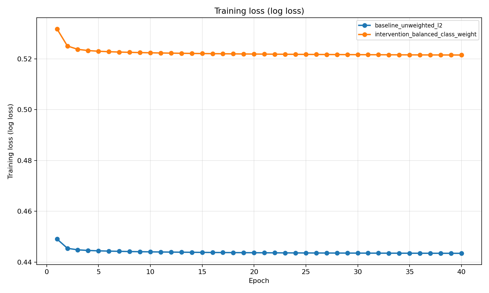
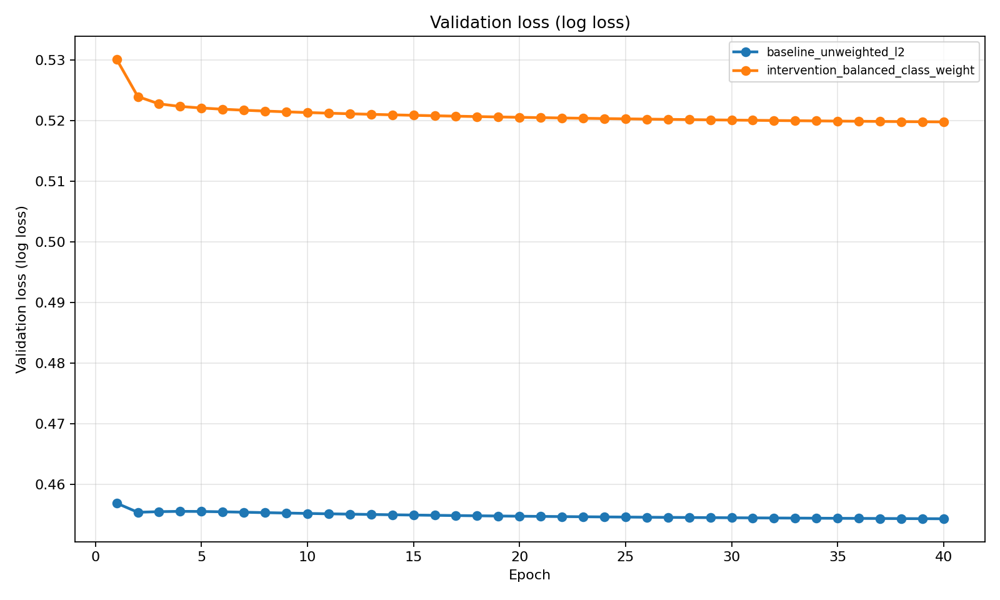
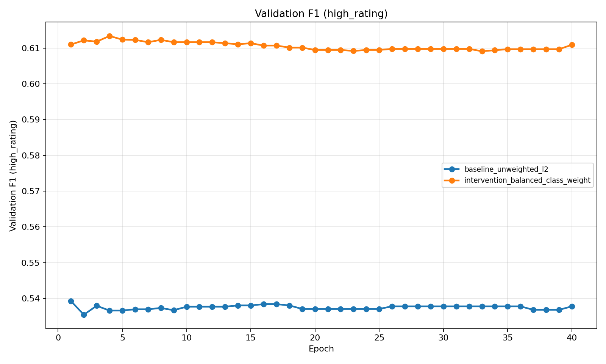
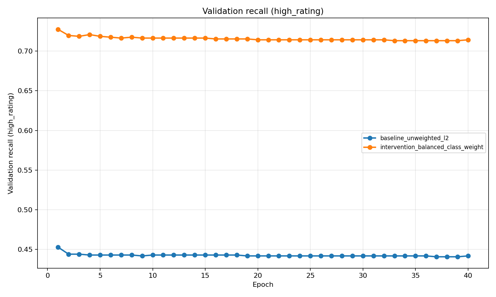

# CS 6320 — Assignment 5

**Name:** Brandon Jackson  
**Semester:** Summer 2026  
**Course:** Deep Learning (CS 6320)

---

## Part A — Model evaluation and generalization evidence (BGG portfolio)

**Work type:** Portfolio baseline evaluation (not approved practice work).

### Task and model summary

| Item | Lock |
| --- | --- |
| Dataset | Kaggle *Board Games Database from BoardGameGeek* (`games.csv`, 21,925 rated games) |
| Unit | One row per game (`BGGId`) |
| Target | `high_rating = 1` if `AvgRating >= 7.0`, else `0` (~26.9% positive) |
| Stakeholder use | Pre-release / preorder stocking screen for a hobby retailer |
| Model evaluated | **Logistic regression** (`SGDClassifier`, log-loss, L2) — Assignment 4 baseline stage |
| Primary intervention | **Balanced class weights** via `sample_weight` (addresses minority-class recall) |
| Seed | `6320` |
| Implementation | `6320-hw5/scripts/`; end-to-end: `bash run_local.sh` |

Features follow the locked Assignment 4 charter: numeric design metadata, `GameWeight`, category flags, simple text-length features, parsed `goodplayers_count`. Hard-excluded rating fields, rank columns, popularity counts, and mis-timed demand fields (`NumOwned`, `NumWant`, `NumWish`).

### Split strategy and audit evidence

**Strategy:** stratified random 70% / 15% / 15% hold-out by game row (each row is one game — no duplicate entities across splits). Seed `6320`. Model selection uses **validation**; **test** is held out for a final check only.

**Why appropriate:** Matches the charter’s hold-out-by-game plan for a static snapshot where each game appears once. Stratification preserves ~27% positive rate in each split.

**Limitation:** Random stratified split does **not** simulate the charter’s pre-release prediction moment; a **time-based** split by `YearPublished` remains a Week 5+ follow-up.

| Split | Rows | % of data | Positive rate |
| --- | ---: | ---: | ---: |
| train | 15,347 | 70.0% | 26.9% |
| validation | 3,289 | 15.0% | 27.7% |
| test | 3,289 | 15.0% | 26.2% |

**Plausibility check:** positive rates are stable across splits (within ~1.5 pp), so the stratified partition did not collapse class balance. Numeric metadata distributions by split are saved in `prep/bgg_split/split_audit/split_numeric_distributions.csv` (e.g. `YearPublished`, `GameWeight` means are comparable across train/validation/test).

**Run evidence:** `python3 scripts/prepare_bgg_data.py`; `python3 scripts/run_split_audit.py`; artifacts under `prep/bgg_split/`.

### Aggregate metrics

**Majority-class baseline** (always predict not-high): validation accuracy **72.3%**, F1 **0.0**, recall **0.0** on `high_rating=1`.

| Run | Split | Accuracy | Precision (pos) | Recall (pos) | F1 (pos) | ROC-AUC |
| --- | --- | ---: | ---: | ---: | ---: | ---: |
| Baseline (unweighted) | validation | 0.790 | 0.687 | 0.442 | 0.538 | 0.814 |
| Baseline (unweighted) | test | 0.803 | 0.678 | 0.473 | 0.557 | 0.831 |
| Intervention (balanced weights) | validation | 0.748 | 0.534 | **0.714** | **0.611** | 0.815 |
| Intervention (balanced weights) | test | 0.762 | 0.532 | **0.753** | **0.624** | 0.832 |

The baseline beats the majority class on F1 and ROC-AUC but **under-recalls** high-rated games. The intervention trades some accuracy/precision for much better minority recall while holding ROC-AUC flat.

### Learning curves (train vs validation)

*Figures 1–4: Baseline vs balanced-weight intervention; 40 SGD epochs, learning rate 0.001.*

**Generalization diagnosis:** Train and validation **loss/F1 track closely** for both runs (no large train–val divergence). Evidence suggests **plausible generalization at this capacity**, not severe overfitting. The main failure mode is **class imbalance handling**, not runaway train fit: baseline validation recall stays ~0.44 while accuracy looks acceptable.

### Generalization intervention

| Report field | Content |
| --- | --- |
| **Observed issue** | Unweighted baseline favors the majority class — high **accuracy (79%)** but **low recall (44%)** on `high_rating=1`, poor retailer utility for “don’t miss hits.” |
| **Expected test** | Balanced class weights should raise recall/F1 on the minority class without requiring a new architecture. |
| **Intervention** | Same features and L2 (`alpha=1e-4`); apply `compute_class_weight('balanced')` through `sample_weight` on training only. |
| **Before (validation)** | F1 **0.538**, recall **0.442**, precision **0.687** |
| **After (validation)** | F1 **0.611**, recall **0.714**, precision **0.534** |
| **What changed** | Better minority detection; lower precision and accuracy — expected trade-off for imbalance. ROC-AUC unchanged (~0.815). |
| **Limitation** | Single linear baseline; no time-split; calibration still poor (below). |

### Error and slice analysis (intervention model, validation)

**Confusion matrix (validation):**

|  | Pred 0 | Pred 1 |
| --- | ---: | ---: |
| **True 0** | 1,811 | 568 |
| **True 1** | 260 | 650 |

**Slice — `GameWeight` (complexity):**

| Bin | n | Positive rate | F1 (high_rating) | Recall (high_rating) |
| --- | ---: | ---: | ---: | ---: |
| light (<2) | 1,698 | 11.8% | 0.31 | 0.28 |
| medium | 1,134 | 36.2% | 0.58 | 0.73 |
| heavy | 392 | 63.5% | 0.78 | 0.98 |
| very heavy | 65 | 78.5% | 0.88 | 1.00 |

**Interpretation:** The model works best on heavier games where the positive class is more common; **light games** remain hard — consistent with weak metadata signal and representativeness limits in the charter.

Year-level slices (`outputs/error_analysis/slice_by_year.csv`) show small-n bins; several older/low-count years have unstable precision. High-confidence errors (`confidence >= 0.8` and wrong): saved in `outputs/error_analysis/high_confidence_errors.csv`.

### Calibration

Calibration is **meaningful** for this binary screening task (probabilities drive stock/skip thresholds).

Decile reliability bins (`outputs/error_analysis/calibration_bins.csv`) show **systematic overconfidence**: predicted probabilities exceed observed positive rates in most bins (e.g. mean predicted **0.52** vs observed **0.30** in the 0.47–0.58 bin; gap up to ~0.22 in mid bins). The balanced-weight model improves recall but **does not yet produce trustworthy probability estimates** for deployment thresholds.

### Run evidence (local)

- Command: `bash run_local.sh` from repo root
- Data: `6320-hw2/part_b/data/bgg/games.csv` (or `GAMES_CSV`)
- Artifacts: `prep/bgg_split/manifest.json`, `outputs/*/history.csv`, `outputs/plots/*.png`, `outputs/error_analysis/*.csv`
- Compute: local CPU only (~seconds); CHPC not required for this dataset/model size

---

## Part B — Portfolio audit update and reliability judgment

### Audit risk trace (Assignment 4 → Week 5 evidence)

| A4 risk / success criterion | Week 5 evidence | Status |
| --- | --- | --- |
| **Class imbalance (~27% positive)** — report F1/recall, not accuracy alone | Majority F1=0; baseline acc 79% but recall 44%; intervention recall 71% val / 75% test | **Confirmed** — imbalance distorts accuracy; weighting helps recall |
| **Leakage / feature timing** — exclude rating & mis-timed demand fields | Manifest lists exclusions; model uses design metadata only | **Partially tested** — exclusions enforced in prep; time-stamp audit not yet done |
| **Representativeness** — BGG enthusiast bias; not universal quality | Slices show weak performance on **light** games and sparse year bins | **Confirmed risk in practice** |
| **Success: classical baseline beats majority** | ROC-AUC ~0.81 vs 0.5; F1 > 0 vs 0 | **Met** |
| **Honest hold-out evaluation** | Stratified split audit; test metrics reported once | **Met for random split**; time-split still open |
| **Responsible use** — screening aid, human review | Calibration gaps + slice weakness argue against automated decisions | **Reinforced** |

### Reliability judgment (bounded, current stage)

**Supported now:** A leakage-aware **tabular baseline** can rank games better than chance (ROC-AUC ~0.83 test) and better than always predicting “not high.” Balanced weighting improves **minority recall** for a “don’t miss hits” retailer story. Train/validation curves do not show runaway overfitting at this model size.

**Not supported:** Deployment-ready stocking decisions. Probability outputs are **miscalibrated**; **light-weight** games are poorly served; random split does not prove pre-release generalization; no mechanics join beyond category flags yet; no human-in-the-loop workflow tested.

**Recommendation:** **Use for internal screening only** — flag titles for human review, not auto stock/skip. Prefer intervention weights when recall matters more than precision; do not trust raw probability thresholds until recalibration.

### Evidence still needed before client-facing use

- Time-based split / recent-release cohort evaluation (charter follow-up)
- Feature-timing audit on any newly added fields
- Recalibration (Platt scaling or isotonic) on validation, checked on test
- Gradient-boosted trees (A4 initial candidate) vs logistic — next staged model
- Error review with publisher/franchise grouping to catch memorization via title text proxies

### Next staged model improvement (from A4 plan)

| Stage | Next step | Why |
| --- | --- | --- |
| **Baseline** | Done — majority + logistic with imbalance diagnosis | Establishes floor and metric story |
| **Initial candidate** | **Gradient-boosted trees** on same feature manifest | Capture nonlinear metadata/category interactions |
| **Revised alternative** | Recalibrated probabilities or simpler logistic if trees overfit | Address calibration gap |
| **Final evidence** | Time-split + stakeholder cost matrix (false stock vs false skip) | Tie metrics to retailer decision |

---

## AI disclosure

**Tool:** Cursor (Composer)

**AI-assisted:** Repo scaffolding, sklearn training/evaluation scripts, Week 5 example patterns, first-draft writeup prose.

**My work:** Locked portfolio path (no TLC practice); chose balanced-weight intervention from baseline recall failure; ran and verified all local metrics, slices, and calibration tables against saved outputs.

**Certification:** I certify that all work not described above is my own, and I verified AI-generated content for accuracy.
